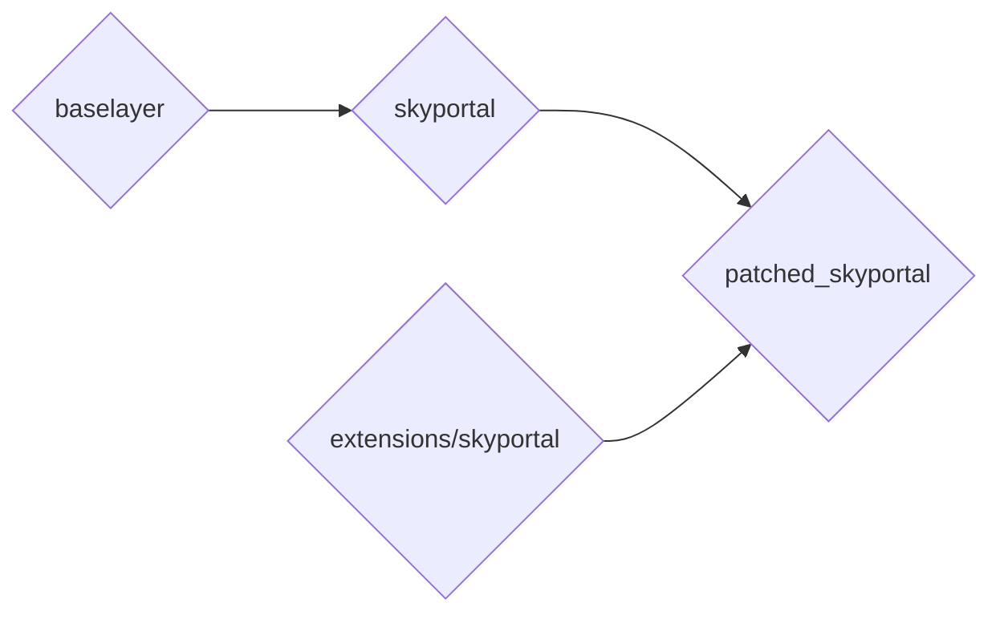
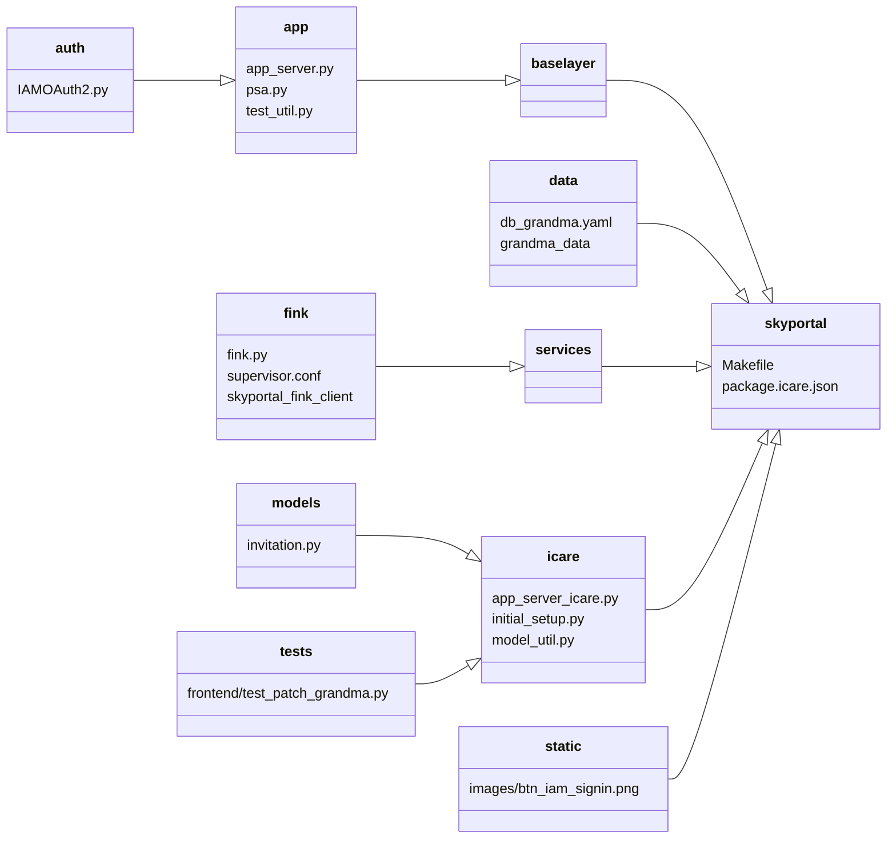
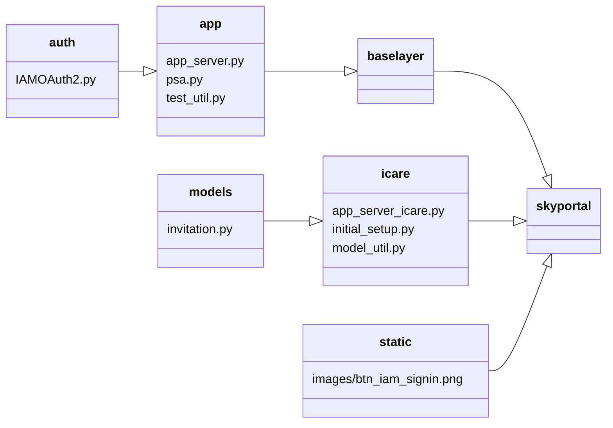
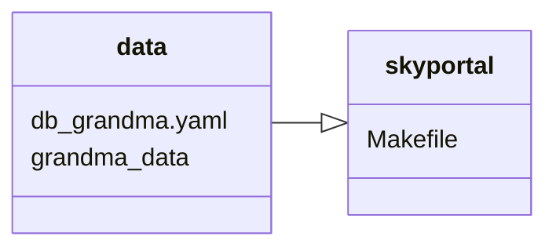
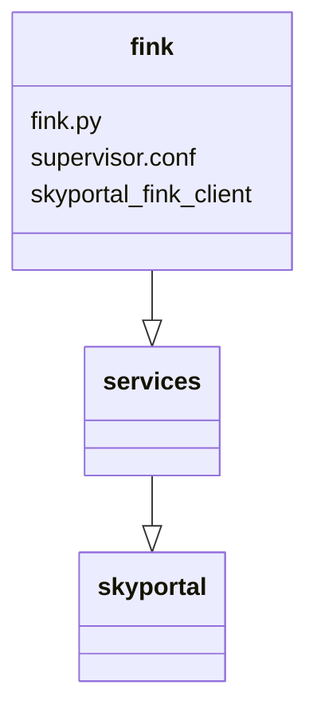
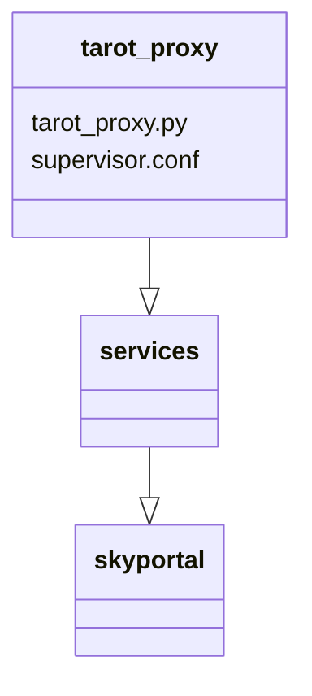

# Architecture

## System Architecture

ICARE works in a similar way to [Fritz Marshal](https://fritz.science), but with some noticeable differences. Let's detail the system's architecture:



Using basic SkyPortal, you have baselayer as a submodule, and skyportal on top of it adding backend and frontend.

*One important thing keep in mind, is that baselayer is where the authentication with Google is handled.*

Here, we want to add features on top of skyportal, but also modify existing features in both skyportal and baselayer.
In order to do this, we have an extensions directory, containing the different features we want to add.
It could have extensions other than skyportal if we need to run other apps at the same time as skyportal, but for now we only have an extensions/skyportal directory containing new/modified features for skyportal and baselayer. When building the app, we simply need to copy skyportal to a directory called `patched_skyportal` and then copy the extensions/skyportal directory to the same directory, replacing skyportal's original files with the ones in `extensions/skyportal`.
Here is how it is structured:



Let's break it down.

### Authentication
First, we wanted to use a different authentication system than Google's: IAM, so we had to modify files in baselayer and SkyPortal.



In baselayer, everything related to the authentication is located in the baselayer/app directory. In there, we have the following files:

- app_server.py
- psa.py
- test_util.py

app_server.py is the main file for the app. It is the bridge between API routes and handlers, serving the requests coming from the frontend or simple API calls. But also, it happens to be the file that handles the authentication with python social auth.

```
settings = {
    ...
    "SOCIAL_AUTH_AUTHENTICATION_BACKENDS": (
        "social_core.backends.google.GoogleOAuth2",
    ),
    ...
    "SOCIAL_AUTH_GOOGLE_OAUTH2_KEY": cfg["server.auth.google_oauth2_key"],
    "SOCIAL_AUTH_GOOGLE_OAUTH2_SECRET": cfg["server.auth.google_oauth2_secret"],
    ...
    }

if cfg["server.auth.debug_login"]:
    settings["SOCIAL_AUTH_AUTHENTICATION_BACKENDS"] = (
        "baselayer.app.psa.FakeOAuth2",
    )
```
* In this code snippet, you can see everything in app_server.py responsible for the authentication. First, the path to the authentication handler is defined. Here, it is pointing to `social_core.backends.google.GoogleOAuth2` from the pip package `social-core`. This is the authentication handler that is used by the python social auth library. Then, we define the key and secret for the authentication handler, which are stored in the `config.yaml` file of baselayer and/or skyportal. Last but not least, we define a path to an alternative handler used when starting the app in debug mode (no real authentication, to run tests or in development), which is in `baselayer.app.psa.FakeOAuth2`.

To use IAM instead of Google, we changed those lines to:

```
settings = {
    ...
    "SOCIAL_AUTH_AUTHENTICATION_BACKENDS": ("baselayer.app.auth.IAMOAuth2.IAMOAuth2",),
    ...
    "SOCIAL_AUTH_IAM_OAUTH2_KEY": cfg["server.auth.iam_oauth2_key"],
    "SOCIAL_AUTH_IAM_OAUTH2_SECRET": cfg["server.auth.iam_oauth2_secret"],
    ...
    }

if cfg["server.auth.debug_login"]:
    settings["SOCIAL_AUTH_AUTHENTICATION_BACKENDS"] = (
        "baselayer.app.psa.FakeOAuth2",
    )
```

You can see that instead of pointing to social_core's GoogleOAuth2, we point to IAMOAuth2 that we added in baselayer/app/auth/IAMOAuth2.py. It is a custom handler that herits from social_core's base OAuth2 handler.
We also had to modify the test utils file, as the auth route is not the same.
Also, as you may notice, the pointer to the debug handler is the same. That is because we modified the handler it is pointing to directly.

Then, we modified some files in skyportal. Those are minor changes, but they are important to know about. Everywhere that the auth route to google is used, we had to change it to the auth route to IAM (iam-oauth). Otherwise, the code is the same. We also added a custom button for the login, with IAM's logo instead of Google's (can be found in `skyportal/static`).

### GRANDMA Data



grandma_data is a submodule, pointing to a git repo containing yaml files where we gather technical information about telescopes and instruments. In SkyPortal, you can populate the DB using yaml files, which is why we added a `db_grandma.yaml` that references to the telescope and instruments from grandma_data.
Then, we modified SkyPortal's Makefile to add a command that allows us to load the data in the database: `make load_grandma_data`.

### SkyPortal-Fink-Client



Seperately from this project, we developed an extension for skyportal called skyportal-fink-client. It is a client that polls alerts from Fink broker, and pushes them to SkyPortal. GRANDMA needs it to receive alerts for kilonova candidates.

To make it easier during deployment (to avoid to configure it and start it manually, and seperately from skyportal), we added a script to configure it and run it automatically in skyportal as a microservice.
When starting SkyPortal, it will wait for the app to be fully started, verify that the DB contains the telescope(s) and instrument(s) associated to the alerts, and then it will start polling and posting them. Everything is logged in the log folder of skyportal along with the other logs of the app. This is done so you can keep a history of the alerts that were polled, to verify if needed that the alerts are being pushed to SkyPortal correctly.


### TAROT Proxy

ICARE includes a second microservice, `tarot_proxy`, that acts as an authenticated HTTP proxy between the ICARE frontend and the TAROT telescope network APIs (Calern, Chili, Réunion).



The proxy runs on port `64910` (configured in `icare.yaml.defaults` under `ports.tarot_proxy`) and forwards authenticated requests to the TAROT endpoints. It is started automatically by supervisor alongside the Fink client when the app starts.

The relevant `icare.yaml` fields are:

```yaml
ports:
  tarot_proxy: 64910

app:
  tarot_proxy_endpoint: http://localhost:64910/
  tarot_endpoint: http://cador.tarotnet.org/ros
  calern_endpoint: http://tca4.tarotnet.org/ros/klotz
  chili_endpoint: http://tch4.tarotnet.org/ros/klotz
  reunion_endpoint: http://tre4.tarotnet.org/ros/klotz
```

## How to add or modify a file in ICARE

The `extensions/skyportal/` directory mirrors SkyPortal's directory structure. During build, every file in `extensions/skyportal/` is copied into `patched_skyportal/`, overwriting the original SkyPortal file if one exists at the same path.

**To override an existing SkyPortal file**, place your modified version at the same relative path inside `extensions/skyportal/`. For example, to modify `skyportal/handlers/api/foo.py`, create `extensions/skyportal/skyportal/handlers/api/foo.py`.

**To add a new file** that doesn't exist in SkyPortal, place it anywhere in `extensions/skyportal/` and it will be copied into `patched_skyportal/` as-is.

**To add a new Python dependency**, add it to the `ext` group in `pyproject.toml`:

```toml
[dependency-groups]
ext = [
    "your-package>=1.0",
    ...
]
```

**To add a new JavaScript dependency**, add it to `extensions/skyportal/package.icare.json`:

```json
{
    "dependencies": {
        "your-package": "^1.0.0"
    }
}
```

Both dependency files are automatically merged into SkyPortal's own dependency files during `build`.

!!! warning
    Never edit files directly in `patched_skyportal/`: it is a generated directory and will be overwritten on the next build. Always make changes in `extensions/skyportal/` or `skyportal/`.
