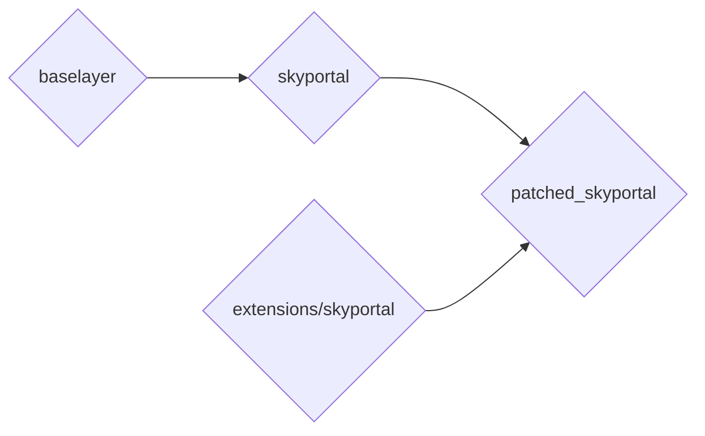
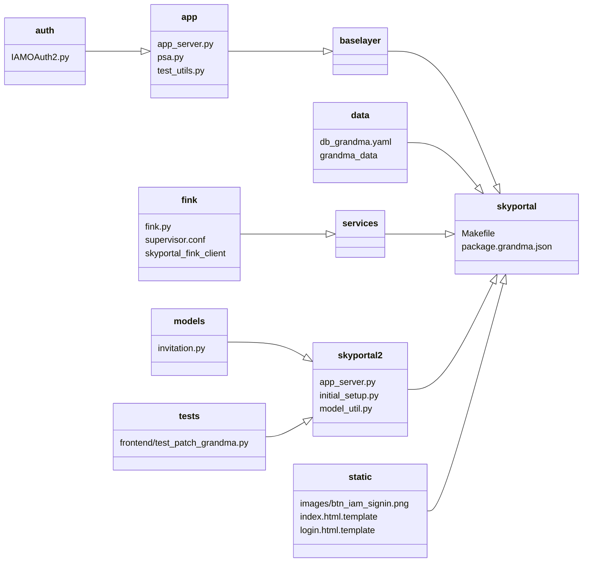
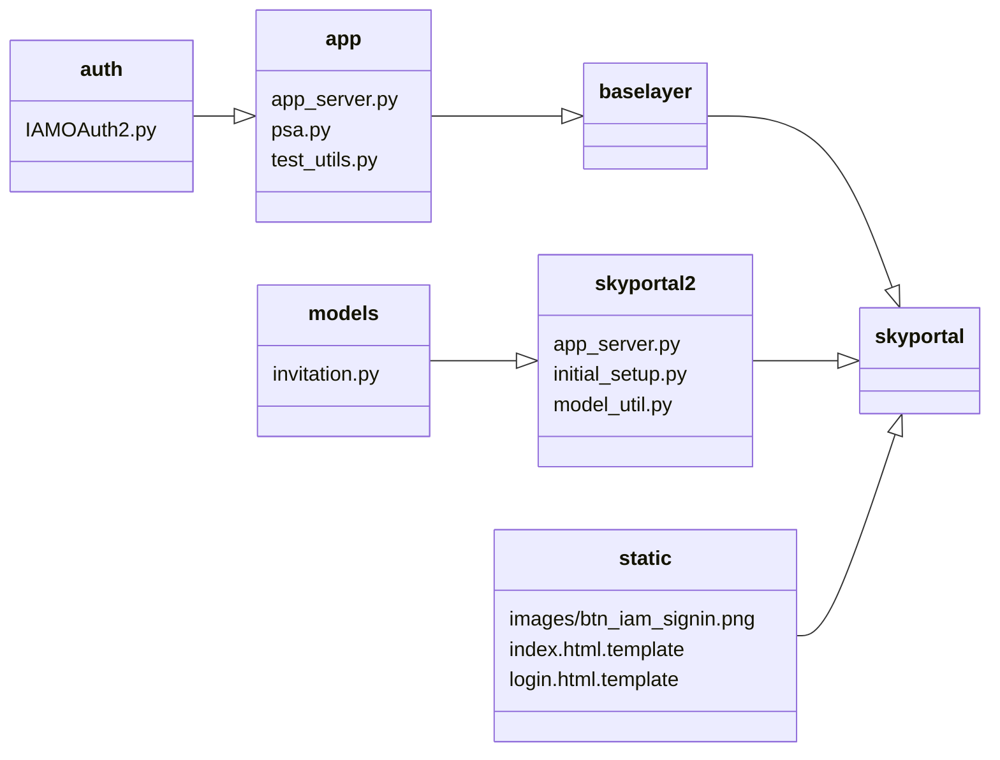
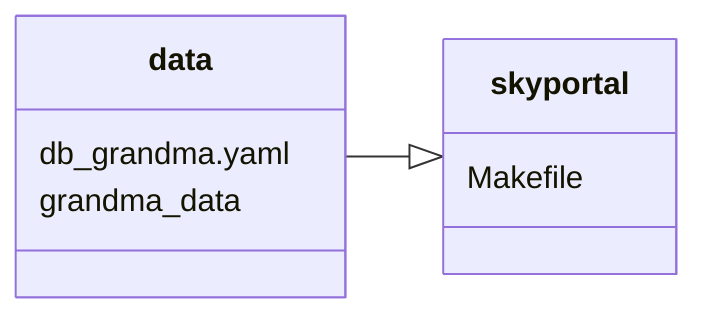
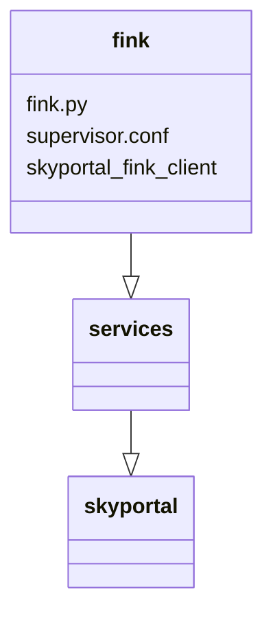

# Developer Guide

## System Architecture

Icare works in a similar way to [Fritz Marshal](), but with some noticeable differences. Let's detail the system's architecture:



Using basic SkyPortal, you have baselayer as a submodule, and skyportal on top of it adding backend and frontend.

*One important thing keep in mind, is that baselayer is where the authentication with Google is handled.*

Here, we want to add features on top of skyportal, but also modify existing features in both skyportal and baselayer.
In order to do this, we have an extensions directory, containing the different features we want to add.
It could have extensions other than skyportal if we need to run other apps at the same time as skyportal, but for now we only have an extensions/skyportal directory containing new/modified features for skyportal and baselayer. When building the app, we simply need to copy skyportal to a directory called `patched_skyportal` and then copy the extensions/skyportal directory to the same directory, replacing skyportal's original files with the ones in `extensions/skyportal`.
Here is how it is structured:



Let's break it down.

### Authentication
First, we wanted to use a different authentication system than Google's: IAM, so we had to modify files in baselayer and SkyPortal.



In baselayer, everything related to the authentication is located in the baselayer/app directory. In there, we have the following files:

- app_server.py
- psa.py
- test_utils.py

app_server.py is the main file for the app. It is the bridge between API routes and handlers, serving the requests coming from the frontend or simple API calls. But also, it happens to be the file that handles the authentication with python social auth.

```
settings = {
    ...
    "SOCIAL_AUTH_AUTHENTICATION_BACKENDS": (
        "social_core.backends.google.GoogleOAuth2",
    ),
    ...
    "SOCIAL_AUTH_GOOGLE_OAUTH2_KEY": cfg["server.auth.google_oauth2_key"],
    "SOCIAL_AUTH_GOOGLE_OAUTH2_SECRET": cfg["server.auth.google_oauth2_secret"],
    ...
    }

if cfg["server.auth.debug_login"]:
    settings["SOCIAL_AUTH_AUTHENTICATION_BACKENDS"] = (
        "baselayer.app.psa.FakeGoogleOAuth2",
    )
```
* In this code snippet, you can see everything in app_server.py responsible for the authentication. First, the path to the authentication handler is defined. Here, it is pointing to `social_core.backends.google.GoogleOAuth2` from the pip package `social-core`. This is the authentication handler that is used by the python social auth library. Then, we define the key and secret for the authentication handler, which are stored in the `config.yaml` file of baselayer and/or skyportal. Last but not least, we define a path to an alternative handler used when starting the app in debug mode (no real authentication, to run tests or in development), which is in `baselayer.app.psa.FakeGoogleOAuth2`.

To use IAM instead of Google, we changed those lines to:

```
settings = {
    ...
    "SOCIAL_AUTH_AUTHENTICATION_BACKENDS": ("baselayer.app.auth.IAMOAuth2.IAMOAuth2",),
    ...
    "SOCIAL_AUTH_IAM_OAUTH2_KEY": cfg["server.auth.iam_oauth2_key"],
    "SOCIAL_AUTH_IAM_OAUTH2_SECRET": cfg["server.auth.iam_oauth2_secret"],
    ...
    }

if cfg["server.auth.debug_login"]:
    settings["SOCIAL_AUTH_AUTHENTICATION_BACKENDS"] = (
        "baselayer.app.psa.FakeGoogleOAuth2",
    )
```

You can see that instead of pointing to social_core's GoogleOAuth2, we point to IAMOAuth2 that we added in baselayer/app/auth/IAMOAuth2.py. It is a custom handler that herits from social_core's base OAuth2 handler.
We also had to modify the test utils file, as the auth route is not the same.
Also, as you may notice, the pointer to the debug handler is the same. That is because we modified the handler it is pointing to directly.

Then, we modified some files in skyportal. Those are minor changes, but they are important to know about. Everywhere that the auth route to google is used, we had to change it to the auth route to IAM (iam-oauth). Otherwise, the code is the same. We also added a custom button for the login, with IAM's logo instead of Google's (can be found in `skyportal/static`).

### Grandma Data



grandma_data is a submodule, pointing to a git repo containing yaml files where we gather technical information about telescopes and instruments. In SkyPortal, you can populate the DB using yaml files, which is why we added a `db_grandma.yaml` that references to the telescope and instruments from grandma_data.
Then, we modified SkyPortal's Makefile to add a command that allows us to load the data in the database: `make load_grandma_data`.

### SkyPortal-Fink-Client



Seperately from this project, we developed an extension for skyportal called skyportal-fink-client. It is a client that polls alerts from Fink broker, and pushes them to SkyPortal. GRANDMA needs it to receive alerts for kilonova candidates.

To make it easier during deployment (to avoid to configure it and start it manually, and seperately from skyportal), we added a script to configure it and run it automatically in skyportal as a microservice.
When starting SkyPortal, it will wait for the app to be fully started, verify that the DB contains the telescope(s) and instrument(s) associated to the alerts, and then it will start polling and posting them. Everything is logged in the log folder of skyportal along with the other logs of the app. This is done so you can keep a history of the alerts that were polled, to verify if needed that the alerts are being pushed to SkyPortal correctly.


## System Dependencies

### Dependencies

SkyPortal requires the following software to be installed.  We show
how to install them on MacOS and Debian-based systems below.

- Python 3.8 or later
- Supervisor (v>=3.0b2)
- NGINX (v>=1.7)
- PostgreSQL (v>=17)
- Node.JS (v>=20.19.0) / npm (v>=10.8.2)

When installing SkyPortal on Debian-based systems, 2 additional packages are required to be able to install pycurl later on:

- libcurl4-gnutls-dev
- libgnutls28-dev

### Source download, Python environment

Clone the [Icare repository](https://github.com/grandma-collaboration/icare) and start a new
virtual environment.

```
git clone https://github.com/grandma-collaboration/icare
cd icare/
virtualenv env
source env/bin/activate
```

(You can also use `conda` or `pipenv` to create your environment.)

If you are using Windows Subsystem for Linux (WSL) be sure you clone the repository onto a location on the virtual machine, not the mounted Windows drive. Additionally, we recommend that you use WSL 2, and not WSL 1, in order to avoid complications in interfacing with the Linux image's `localhost` network.

### Installation: Debian-based Linux and WSL

1. Install nginx and python

Run the following commands to install the dependencies:
```
sudo apt install nginx supervisor libpq-dev npm python3-pip libcurl4-gnutls-dev libgnutls28-dev
```

2. Installing PostgreSQL

The version of PostgreSQL that is shipped with most Debian-based Linux distributions is not up to date. If you already have an older version installed, you first need to remove it:
```
sudo systemctl stop postgresql
sudo pg_dropcluster --stop <older_version> main
sudo apt-get --purge remove postgresql postgresql-*
sudo rm -r /var/lib/postgresql/<older_version>
sudo rm -r /etc/postgresql/<older_version>
```
Here are the steps to install version 17:
```
sudo apt update && sudo apt upgrade
sudo sh -c 'echo "deb http://apt.postgresql.org/pub/repos/apt $(lsb_release -cs)-pgdg main" > /etc/apt/sources.list.d/pgdg.list'
wget --quiet -O - https://www.postgresql.org/media/keys/ACCC4CF8.asc | sudo apt-key add -
sudo apt -y update
sudo apt -y install postgresql-17
```

To verify if the installation was successful, run the following command:
```
systemctl status postgresql
```
It should be displayed as "Loaded" and "Active".

You can also run:
```
sudo -u postgres psql -c "SELECT version();"
```
to verify that the version is the right one.

Sometimes, if you removed an older version of postgresql before installing a newer one, a cluster won't be automaticcally created for the newer version. You can create a cluster manually by running the following command:
```
sudo pg_createcluster <new_version> main --start
sudo systemctl restart postgresql
```

Then, run the same commands mentionned above to verify that the installation was successful.

3. Installing node.js

In section 1, we installed nginx, python but also the npm in its version shipped with the system. However, that version is not recent enough to run SkyPortal. To update it, run:
```
sudo npm i -g n
sudo n 17
```

*n is an npm package that allows you to switch between versions of node.js and npm easily.*

Then, open a new terminal and run:
```
node --version
```
to verify that you are running the right version (17 or more).

2. Configure your database permissions.

In `pg_hba.conf` (typically located in
`/etc/postgresql/<postgres-version>/main`), insert the following lines
*before* any other `host` lines:

```
host skyportal skyportal 127.0.0.1/32 trust
host skyportal_test skyportal 127.0.0.1/32 trust
host all postgres 127.0.0.1/32 trust
```

If you are deploying SkyPortal using IPv6 rather than IPv4, you should add the following lines instead:

```
host skyportal skyportal ::1/128 trust
host skyportal_test skyportal ::1/128 trust
host all postgres ::1/128 trust
```

In some PostgreSQL installations, the default TCP port may be different from the 5432 value assumed in our default configuration file values. To remedy this, you can either edit your config.yaml file to reflect your system's PostgreSQL default port, or update your system-wide config to use port 5432 by editing /etc/postgresql/12/main/postgresql.conf (replace "12" with your installed version number) and changing the line `port = XXXX` (where "XXXX" is whatever the system default was) to `port = 5432`.

Restart PostgreSQL:

```
sudo service postgresql restart
```

3. To run the test suite, you'll need Geckodriver:

- Download the latest version from https://github.com/mozilla/geckodriver/releases/
- Extract the binary to somewhere on your path
- Ensure it runs with `geckodriver --version`

In later versions of Ubuntu (16.04+), you can install Geckodriver through apt:
```
sudo apt install firefox-geckodriver
```

## System Commands

Now that we've explored the architecture of icare, let's see how do we actually add the extensions to SkyPortal, update Skyportal and said extensions, and much more.

In icare, you'll find a launcher directory, containing different commands. The launcher directory follows the same patterns established in Fritz, for consistency sake.

Here are the different commands, all prefixed with `./icare.sh` to run:

- run
- do_update
- build
- diff
- clear
- set_user_role
- load_grandma_data

In this documentation, we'll focus only on the `run` command. Effectively, other commands will we called along with the `run` command as arguments. For example, we can use `./icare.sh run --clear --init` to clear the database, recreate tables and then run the app.

### Starting the app for the first time

First, you need to install the dependencies required to use the commands mentioned in the previous section. Whether you use the `pip` or `conda` package manager, you need to install the packages from the `requirements.txt` file.

```
pip install -r requirements.txt
```
or
```
conda install --file requirements.txt
```

To run the app for the first time, we can use the `run` command as such:
```
./icare.sh run --clear --init
```

This will install all the required dependencies, clear the database if it exists, create the database, and run the app.

### Updating SkyPortal and the extensions (development)

To update the version of SkyPortal that is pinned in the repo, first create a new branch (if you are working on a fork, which is preferable, don't forget to merge the changes coming from upstream in your main branch first) and use
```
git checkout <new-branch-name>
```
to switch to the new branch. Then, to be sure that the submodules are all at the right version pinned to the branch (they might be on an older or newer version if you made some modifications earlier, even on another branch. Submodules usually don't automatically checkout to the pinned version after you checkout to a branch), use:
```
git pull
git submodule update --init --recursive
```

Last but not least, remove the `patched_skyportal` and `previous_skyportal` directories if they exist:
```
sudo rm -rf patched_skyportal
sudo rm -rf precious_skyportal
```

Now, you can use the `do_update` command as such:
```
./icare.sh run --do_update
```

This will update the version of SkyPortal that is pinned in the app. When doing so, we are basically running a `git diff` to see which files have been modified. If some of those files are also the files we have copied and modified in the extensions folder, we need to merge new changes in the extensions folder too. If we don't do this, when replacing skyportal's files by the files in the extensions folder, we'll lose new changes. And besides from missing on new features, it is very likely to break the app. Which is why, when we detect that some changes coming from skyportal are made on same files we have in the extensions folder, we give the user 3 choices:

- Stop running the app, and merge new changes in the extensions folder. The user can then go to the extensions folder and fix potential merge conflict before running the app again.
- Update SkyPortal and run the app without updating files in the extensions folder. This will likely break the app.
- Cancel the update and run the app normally.

*These features are still in development, you might experience some issues.*

After updating the version that is pinned, and fixing potential merge conflict, rerun the app with:
```
./icare.sh run
```

If everything seems to be working fine, commit your changes to your branch (don't forget to `git add` all the modified files, including skyportal itself using `git add skyportal`), open a PR and wait for the GitHUb actions to finish running. If everything is green, ask for a review and merge the changes to the main branch **ONLY** when all reviewers approved your changes.

### Updating icare (production)

The commands mentioned above are meant to update the version of skyportal that is pinned in the repo, along with the extensions. Once that is done, the developer has to commit new changes to the branch that is used in production.

On your local environment:
```
# 1. Update your repo 
git pull
git submodule update --init --recursive
./icare.sh run --do_update

# 2. Push to Icare the last modifications
git add skyportal
git commit -m "Bump to skyportal <commit_hash>"
git push
```

Then, on the production machine :
1. Reboot the machine to stop Icare and connect as root (`sudo su`)
2. Go to `/htdocs/skyportal/deployment/grandma_skyportal/`
2. Update to the last version of ICARE and its submodule :
```
git pull
git submodule update --init --recursive
```
3. Run this command. It will stamp the current database state using alembic. This is done so that when updating the app, if the models of some tables has been modified, or if new tables have been added, alembic is able to apply the changes to the database. Then skyportal will be updated, and changes from the extensions directory will be applied.
When the app runs, as the database's state has been stamped, a migration server should start automatically and update the database.
```
./icare_prod.sh run --update_prod
```

4. If everything is ok in the last step, run the following command :
```
./icare_prod.sh run --production
```

#### Troubleshooting

##### `./icare_prod.sh run --update_prod` failed  
Make sure that postgres and nginx are running and restart them if their process are dead.
```
systemctl status posgresql
systemctl status nginx
```
If needed, run :
```
systemctl restart posgresql
systemctl restart nginx
```

##### Error 502 after an Icare update  

If after a Icare update you go to Icare portal and you have an error message with a 502 error code, then perform the following steps:
1. Press Ctrl Z and run `bg` to put Icare in the background without stopping the process.

2. Run `setenforce 0` to set the enforcement mode of the SELinux to permissive.

### Loading data from the grandma_data repo

To load data from the grandma_data repo, we can use the `load_grandma_data` command as such:
```
./icare.sh load_grandma_data
```

### Set user roles

In SkyPortal, there is a script that an admin can use to set user roles manually from the terminal in production for example.
Here, we just added a command to call that script with the same syntax as other command from grandma_skyportal.
You can use it as such:
```
./icare.sh set_user_role --user=<user_name> --role=<role_with_underscores_instead_of_spaces>
```

To see the list of user and roles, run:
```
./icare.sh set_user_role --list
```

## Access the Production VM (at IJCLAB)

We deployed icare on a VM at IJCLAB/CNRS, which is accessible remotely via SSH. However, for security reasons, we don't want to expose an SSH connection to the public internet. Which is why you will need an IJCLAB account, so you can first connect to a public VM of IJCLAB, and then connect to the private VM dedicated to icare.

- Connect to the public VM of IJCLAB:
```
ssh <your_user_name>@lx3.lal.in2p3.fr
```

- Connect to the private VM running icare (to be able to do so, you first need to ask someone at the "Service d'exploitation", or someone that already has access to the VM to add your SSH key to the grandmadmin user):
```
ssh grandmadmin@grandma-v2.ijclab.in2p3.fr
```

Now that you are connected, you can use the following commands:

- to elevate your privileges, run
```
sudo -i
```

- to activate the conda environment with all the dependencies needed to run the app, run:
```
conda activate skyportal
```

- then go to the `icare` folder and run the following command:
```
cd /pdisk/htdocs/skyportal/deployment/icare
```

- to run the app, run
```
./icare.sh run
```

We advise you to open a second terminal, go to the `patched_skyportal` folder and run:
```
make log
```
so you can see the logs of the app in real time, and verify that everything is running correctly.

When the app is fully started, and if you haven't encountered any bugs/errors, you can use the following command to make the app available to the public:
```
setenforce 0
```

*Help: If any of the commands mentioned above fail for some reason, please make sure that everytime you open a new terminal, you connect to the machine again via SSH, and that you elevate your privileges using `sudo -i`*

For now, starting the app is not done automatically when the VM reboots. You can do it manually by running the commands mentioned above.

After starting the app remotely from your computer, you will very likely close the SSH connection, effectively closing the terminal in which you ran the app. This is fine, and won't close the app. However, if you want to stop the app, you won't be able to go back to that terminal to close it using the `Ctrl+C` key as you would normally do. Instead, you need to reboot the VM, connect to it, and repeat the steps detailed above.

If you have trouble starting or accessing the app, maybe that Nginx or PostgreSQL did not start correctly. First stop the app, and use `systemctl` to see the status of a service (they should be named `nginx` and `postgresql-17`):
```
systemctl status <service_name>
```

If it is not displayed as active and loaded, try restarting it using:
```
systemctl restart <service_name>
```

Verify their status once more, and if everything seems to be working you should be able to start the app again.

## Deploy on a new VM

If you are using a new VM, you might have to install the python dependencies first. To do so, run the following command with conda:
```
conda install --file skyportal/requirements.txt
conda install --file skyportal/baselayer/requirements.txt
```

or with pip:
```
pip install -r skyportal/requirements.txt
pip install -r skyportal/baselayer/requirements.txt
```

If you encounter some issues, please refer to the last section of this page for more information. Some packages are not available in conda yet, so if you are using conda, you might need to install them using pip (but with your conda environment still activated).

## Common issues

### NPM and Node.js version

First, we need to detail how the VM works. The system is based on CentOS 7, which is a Linux distribution. When rebooting it from the terminal, it behaves normally and keeps everything installed. However, the goal is that the system (the OS) is independent of the app, so that it can be reinstalled completely and the app can be started again. This is done so that the same system image can be used to deploy the same app and DB again on a new VM easily for example. This is why the OS is installed on a temporary disk, but the app on a permanent one.

When the VM is completely restarted, for example by someone from the "Service d'exploitation", the system will be reinstalled completely.

One issue we encountered is that the version of some packages needed by skyportal shipped with CentOS are outdated. So for some packages, instead of installing them from the system's repo upon restart, they are installed on the permanent disk, where the app and the database are also kept. This is done for Postgres (the database), and for conda (the python environment manager). However, this is not done yet for Node.js and NPM (the package manager for Node.js). Therefore, one problem you can encounter if the VM has been fully restarted, is that SkyPortal won't run because node.js is not up to date.

To fix this issue, (needs to be reran everytime the VM is fully restarted, it is not needed for a simple reboot ran in the terminal), run the following command:
```
npm install -g n
```

Then, run the following command:
```
n 17
```

This will install an npm package called n, which allows you to switch between different versions of node.js and npm, and then install version 17 of node.js, we is conveniently shipped with the right version of npm.

### Installing Python dependencies

To manage python dependencies in production, we use conda. Conda is a python package manager that is used to manage the dependencies of the app. It is a bit more complicated than pip, but all packages are pre-compiled, and you can also switch between versions of python very easily.

However, some dependencies of SkyPortal are not available in conda, as they haven't been published there yet.
What we recommend when running skyportal for the first time is to try to install as many packages as possible with conda, and then install the remaining dependencies with pip (with the conda environment activated).

Good luck!
