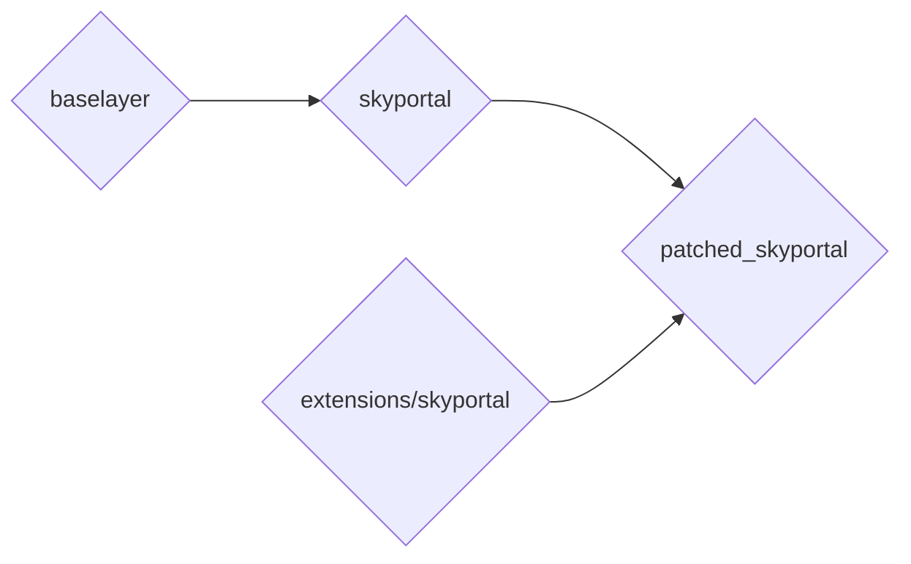
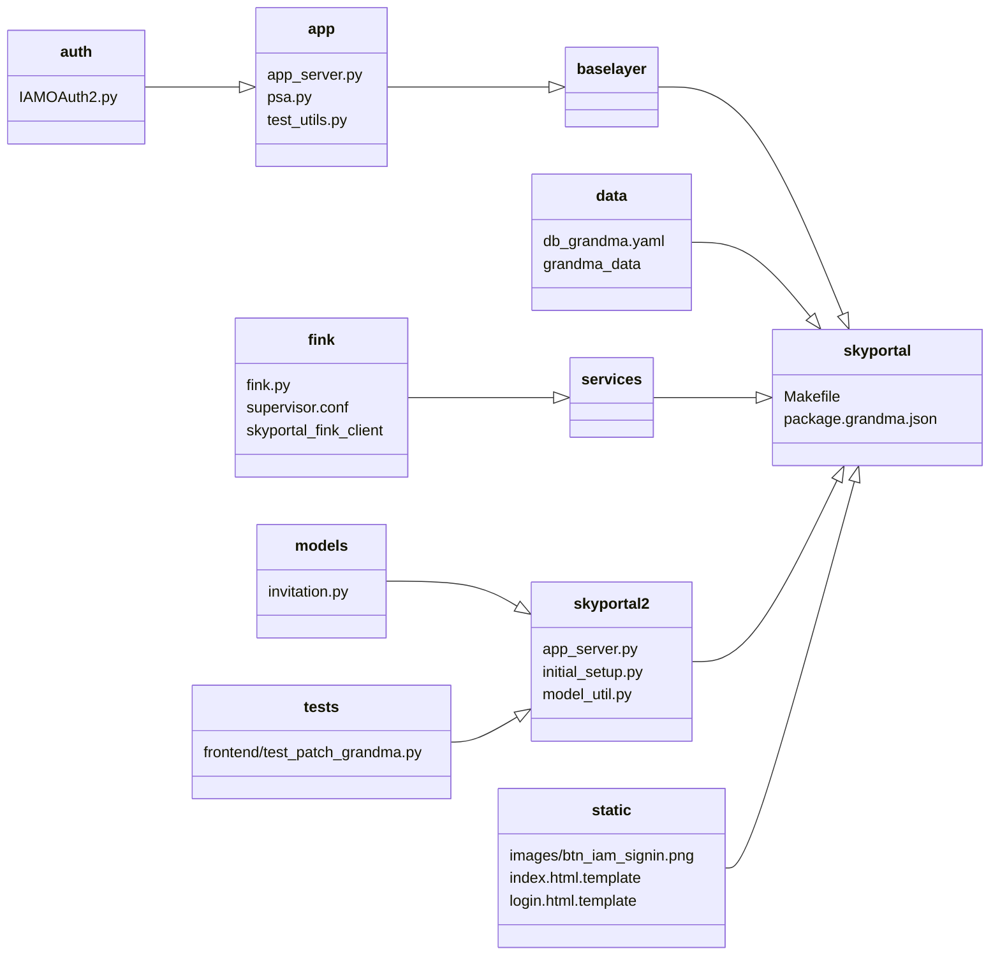
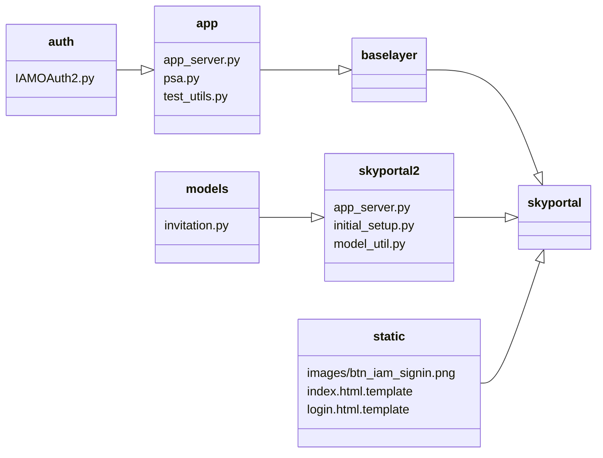
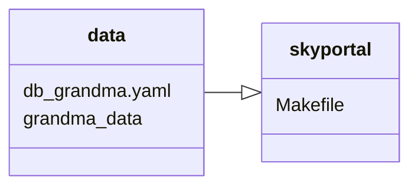
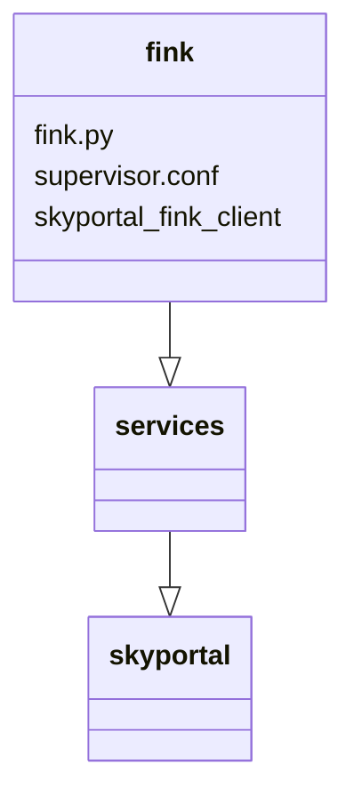

# Developer Guide

## System Architecture

grandma_skyportal works in a similar way to [Fritz Marshal](), but with some noticeable differences. Let's detail the system's architecture:



Using basic SkyPortal, you have baselayer as a submodule, and skyportal on top of it adding backend and frontend.

*Important to note for later, is that baselayer is where the authentication with Google is handled.*

Here, we want to add feature on top of skyportal, but also modify existing features in both skyportal and baselayer.
In order to do this, we have an extensions directory, containing the different features we want to add.
It could have extensions other than skyportal if we need to run other apps at the same time as skyportal, but for now we only have an extensions/skyportal directory containing new/modified features for skyportal and baselayer.
Here is how it is structured:



Let's break it down.

### Authentication
First, we wanted to use a different authentication system than Google's: IAM, so we had to modify files in baselayer and SkyPortal.



In baselayer, everything related to the authentication is located in the baselayer/app directory. In there, we have the following files:

- app_server.py
- psa.py
- test_utils.py

app_server.py is the main file for the app. It is the bridge between routes and handlers, effectively serving the requests, coming from the frontend or simple API calls. But also, it happens to be the file that handles the authentication with python social auth.

```
settings = {
    ...
    "SOCIAL_AUTH_AUTHENTICATION_BACKENDS": (
        "social_core.backends.google.GoogleOAuth2",
    ),
    ...
    "SOCIAL_AUTH_GOOGLE_OAUTH2_KEY": cfg["server.auth.google_oauth2_key"],
    "SOCIAL_AUTH_GOOGLE_OAUTH2_SECRET": cfg["server.auth.google_oauth2_secret"],
    ...
    }

if cfg["server.auth.debug_login"]:
    settings["SOCIAL_AUTH_AUTHENTICATION_BACKENDS"] = (
        "baselayer.app.psa.FakeGoogleOAuth2",
    )
```
* In this code snippet, you can see everything in app_server.py responsible for the authentication. First, the path to the authentication handler is defined. Here, it is pointing to `social_core.backends.google.GoogleOAuth2` from the pip package `social-core`. This is the authentication handler that is used by the python social auth library. Then, we define the key and secret for the authentication handler, which are stored in the `config.yaml` file of baselayer and/or skyportal. Last but not least we define a path to an alternative handler used when starting the app in debug mode (no real authentication, to run tests or in development), which is `baselayer.app.psa.FakeGoogleOAuth2`.

To use IAM instead of Google, we changed those lines to:

```
settings = {
    ...
    "SOCIAL_AUTH_AUTHENTICATION_BACKENDS": ("baselayer.app.auth.IAMOAuth2.IAMOAuth2",),
    ...
    "SOCIAL_AUTH_IAM_OAUTH2_KEY": cfg["server.auth.iam_oauth2_key"],
    "SOCIAL_AUTH_IAM_OAUTH2_SECRET": cfg["server.auth.iam_oauth2_secret"],
    ...
    }

if cfg["server.auth.debug_login"]:
    settings["SOCIAL_AUTH_AUTHENTICATION_BACKENDS"] = (
        "baselayer.app.psa.FakeGoogleOAuth2",
    )
```

As you can notice, the pointer to the debug handler is the same. That is because we modified the handler it is pointing to directly. Also, you can see that instead of pointing to social_core's GoogleOAuth2, we point to IAMOAuth2 that we added in baselayer/app/auth/IAMOAuth2.py. It is a custom handler that herits from social_core's base OAuth2 handler.
We also had to modify the test utils file, as the auth route is not the same.

Then, we modified some files in skyportal. Those are minor changes, but they are important to notice. Every where that the auth route to google is used, we have to change it to the auth route to IAM. Otherwise, the code is the same. We also added a custom button for the login, with IAM's logo instead of Google's.

### Grandma Data



grandma_data is a submodule, pointing to a git repo where we gather technical information about telescopes and instruments. They are contained in yaml files, and we added `db_grandma.yaml` that references to the telescope and instruments in the git repo.
Then, we added a Makefile in skyportal, that adds a command to load the data in the database: `make load_grandma_data`.

### SkyPortal-Fink-Client



Seperately from this project, we developed an extension for skyportal called skyportal-fink-client. It is a client that polls alerts data from Fink broker, and pushes them to SkyPortal. GRANDMA needs it to receive alerts for kilonova candidates.

To make it easier during deployment (to avoid to configure it and start it manually and seperately from skyportal), we added a script to configure it and run it automatically with skyportal as a microservice.
When starting SkyPortal, it will wait for the app to be fully started, verify that the DB contains the telescope(s) and instrument(s) associated to the alerts, and then it will start polling them. Everything is logged in the log folder of skyportal along with the other logs of the app. This is done so you can keep a history of the alerts that were polled, so you can verify that the alerts are being pushed to SkyPortal correctly.

## System Commands

Now that we've explored the architecture of grandma_skyportal, let's see how do we actually add the extensions to SkyPortal, update Skyportal and said extensions, and much more.

In grandma_skyportal, you'll find a launcher directory, containing different commands. The taxonomy of the launcher directly follows the one established in Fritz, for consistency sake.

Here are the diffent commands, all prefixed with `./grandma.sh`.

- run
- update
- build
- diff
- clear
- set_user_role
- load_grandma_data

In this documentation, we'll focus only on the use of the `run` command. Effectively, other commands will we called along with the `run` command, as arguments. For example, we can use `./grandma.sh run --clear --init` to clear the database, recreate tables and then run the app.

### Starting the app for the first time

To run the app for the first time, we can use the `run` command as such:
```
./grandma.sh run --clear --init
```

This will install all the required dependencies, clear the database if it exists, create the database, and run the app.

### Updating SkyPortal and the extensions (development)

To update the version of SkyPortal that is pinned in the app, we can use the `update` command as such:
```
./grandma.sh run --do_update
```

This will update the version of SkyPortal that is pinned in the app. When doing so, we are basically running a `git diff` to see which files have been modified. If some of these files are also the files we have modified in the extensions folder, we also need to merge new changes into the extensions folder. If we don't do this, when replacing skyportal's files by the files in the extensions folder, we'll lose the changes we new changes from SkyPortal. Besides from missing on new features, it is very likely to break the app. Which is why, when we detect that some skyportal changes affect the files in extensions, we give the user 3 choices:

- Stop running the app, and merge new changes in the extensions folder. The user can then go to the extensions folder and fix potential merge conflict before running the app again.
- Update SkyPortal and run the app without updating files in the extensions folder. This will likely break the app.
- Cancel the update and run the app normally.

*These features are still in development, you might experience some issues.*

### Loading data from the grandma_data repo

To load data from the grandma_data repo, we can use the `load_grandma_data` command as such:
```
./grandma.sh load_grandma_data
```

### Set user roles

In SkyPortal, there is a script that an admin can use to set user roles manually from the terminal in production for example.
Here, we just added a command to call that script with the same syntax as other command from grandma_skyportal.
You can use it as such:
```
./grandma.sh set_user_role --user=<user_name> --role=<role_with_underscores_instead_of_spaces>
```

To see the list of user and roles, run:
```
./grandma.sh set_user_role --list
```

### Updating grandma_skyportal (production)

The commands mentioned above are meant to update the version of skyportal that is pinned along with the extensions. Once that is done, the developer has to commit new changes to the branch that is used in production.

Before attempting to update the app in production, we need to make sure that the current state of the database is stamped using alembic. This is done so that when updating the app, if the models of some tables has been modified, or if new tables have been added, alembic is able to apply the changes to the database.
To do that, go to the `patched_skyportal` folder, and run the following command:
```
PYTHONPATH=. alembic -x config=config.yaml stamp head
```

Then, in production, simply stop the app, run
```
git pull
```

to get new changes, and then run
```
./grandma.sh run --update_prod
```
to update the app in production. When the app runs, as the database state has been stamped, a migration server should start automatically and update the database.

## Access the Production VM

We deployed grandma_skyportal on a VM at IJCLAB/CNRS, which is accessible remotely via SSH. However, for security reasons, we don't want to expose an SSH connection to the public internet. Which is why you will need an IJCLAB account, so you can first connect to a public VM of IJCLAB, and then connect to the private VM dedicated to grandma_skyportal.

- Connect to the public VM of IJCLAB:
```
ssh <your_user_name>@lx3.lal.in2p3.fr
```

- Connect to the private VM running grandma_skyportal:
```
ssh grandmadmin@grandma-v2.ijclab.in2p3.fr
```

Now that you are connected, you can use the following commands:

- to elevate your privileges, run
```
sudo -i
```

- to activate the conda environment with all the dependencies needed to run the app, run:
```
conda activate skyportal
```

- then go to the `grandma_skyportal` folder and run the following command:
```
cd /pdisk/htdocs/skyportal/deployment/grandma_skyportal
```

- to run the app, run
```
./grandma.sh run
```

For now, starting the app is not done automatically when the VM reboots. You can do it manually by running the commands mentioned above.

After starting the app remotely from your computer, you will very likely close the SSH connection, effectively closing the terminal in which you ran the app. This is fine, and won't close the app. However, if you want to stop the app, you won't be able to go back to that terminal to close it using the `Ctrl+C` key as you would normally do. Instead, you need to reboot the VM, connect to it, and repeat the steps detailed above.

If you are using a new VM, you might have to install the python dependencies first. To do so, run the following command:
```
conda install --file skyportal/requirements.txt
conda install --file skyportal/baselayer/requirements.txt
```
If you encounter some issues, please refer to the last section of this page for more information. Some packages are not available in conda yet, so you might need to install them using pip instead (but with your conda environment activated).

## Common issues

### NPM and Node.js version

First, we need to detail how the VM works. The system is based on CentOS 7, which is a Linux distribution. When rebooting it from the terminal, it behaves normally and keeps everything installed. However, the goal is that the system is independent of the app, so that it can be reinstalled completely and the app can be started again. This is done so that the same system image can be used to deploy the same app again on a new VM easily for example.

When the VM is completely restarted, for example by someone from the "Service d'exploitation", the system will be reinstalled completely.

One issue we encountered is that the version of some packages neede by skyportal shipped with CentOS are outdated. So for some packages, instead of installing them from the system upon restart, they are installed in a permanent disk, where the app and the database are also kept. This is done for Postgres (the database), and for conda (the python environment manager). However, this is not done yet for Node.js and NPM (the package manager for Node.js). Therefore, one problem you can encounter if the VM has been fully restarted, is that SkyPortal won't run because node.js is not up to date.

To fix this issue, (needs to be reran everytime the Vm is fully restarted, it is not needed for a simple reboot ran in the terminal), run the following command:
```
npm install -g n
```

Then, run the following command:
```
n 17
```

This will install an npm package called n, which allows you to switch between different versions of node.js and npm, and then install version 17 of node.js, we is conveniently shipped with the right version of npm.

### Installing Python dependencies

To manage python dependencies, we use conda. Conda is a python package manager that is used to manage dependencies of the app. It is a bit more complicated than pip, but all packages are already compiled, and you can also switch between versions of python.

However, some dependencies of SkyPortal are not available in conda, as they haven't been published there yet.
What we recommend when running skyportal for the first time is to try to install as many packages with conda as possible, and then install the remaining dependencies with pip (with the conda environment activated).
