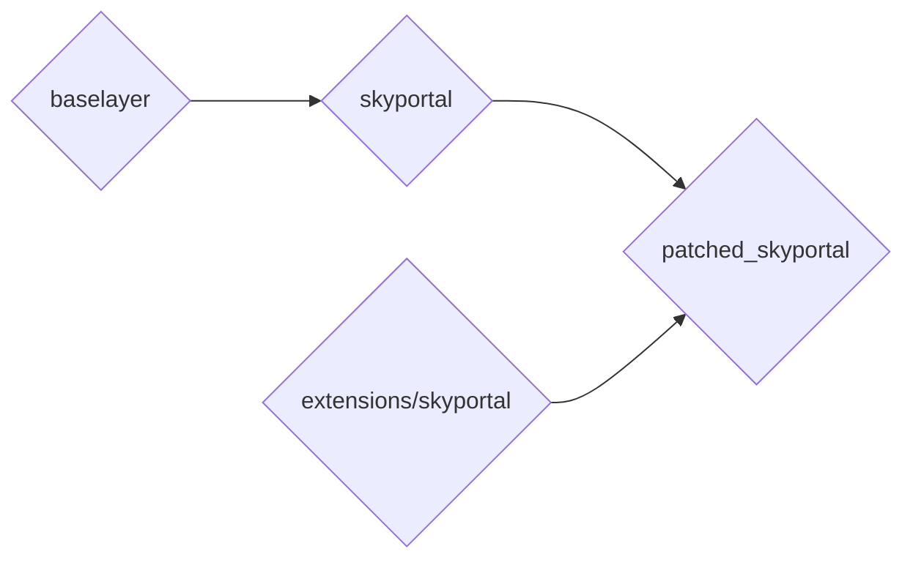
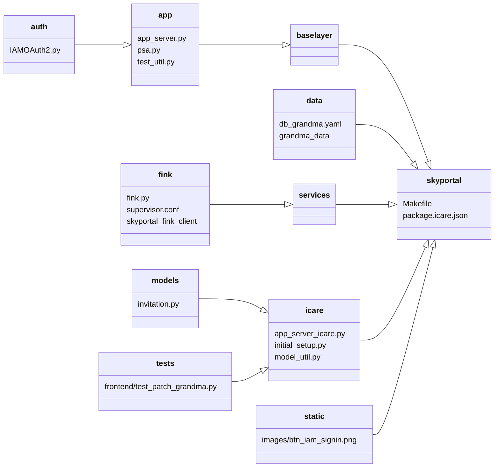
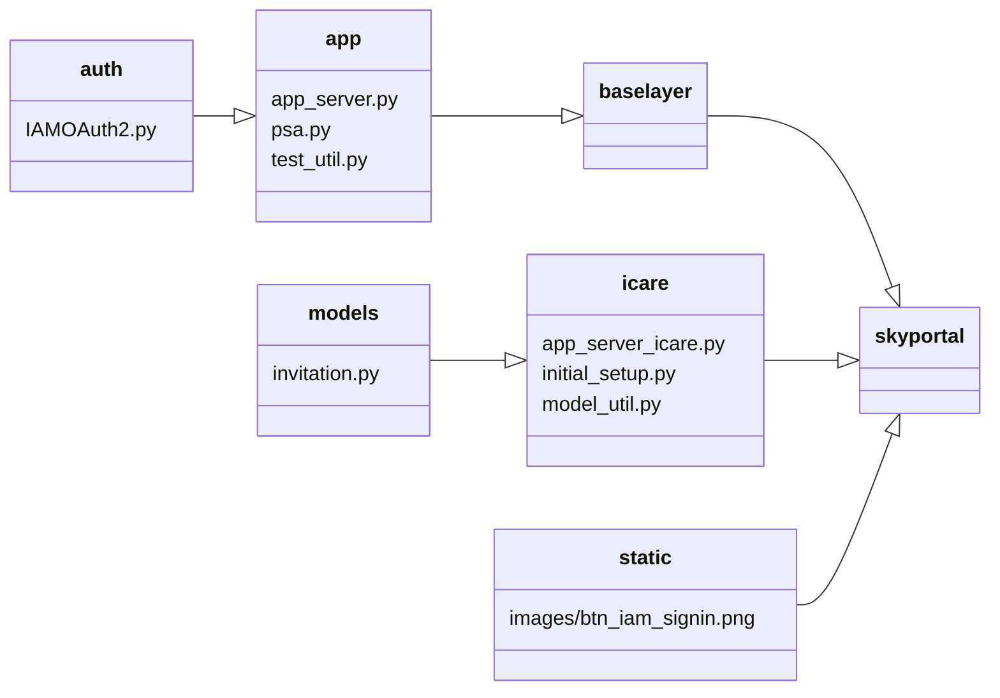
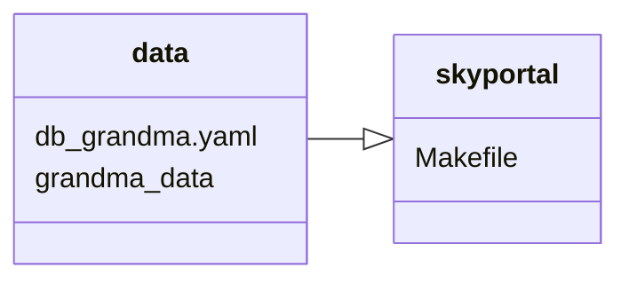
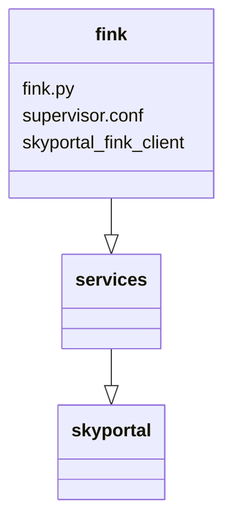
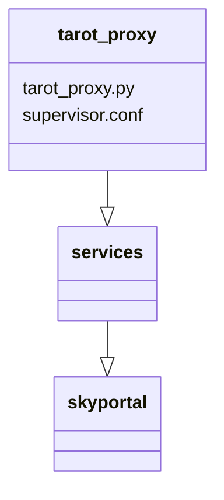

# Developer Guide

## System Architecture

ICARE works in a similar way to [Fritz Marshal](https://fritz.science), but with some noticeable differences. Let's detail the system's architecture:


``` mermaid
graph LR
  A{baselayer} --> B{skyportal};
  B --> D{patched_skyportal};
  C{extensions/skyportal} --> D;
```

Using basic SkyPortal, you have baselayer as a submodule, and skyportal on top of it adding backend and frontend.

*One important thing keep in mind, is that baselayer is where the authentication with Google is handled.*

Here, we want to add features on top of skyportal, but also modify existing features in both skyportal and baselayer.
In order to do this, we have an extensions directory, containing the different features we want to add.
It could have extensions other than skyportal if we need to run other apps at the same time as skyportal, but for now we only have an extensions/skyportal directory containing new/modified features for skyportal and baselayer. When building the app, we simply need to copy skyportal to a directory called `patched_skyportal` and then copy the extensions/skyportal directory to the same directory, replacing skyportal's original files with the ones in `extensions/skyportal`.
Here is how it is structured:


``` mermaid
classDiagram
    direction LR
    app --|> baselayer
    app : app_server.py
    app : psa.py
    app : test_util.py
    auth --|> app
    auth : IAMOAuth2.py

    baselayer --|> skyportal

    data --|> skyportal
    data : db_grandma.yaml
    data : grandma_data

    services --|> skyportal
    fink --|> services
    fink : fink.py
    fink : supervisor.conf
    fink : skyportal_fink_client

    icare --|> skyportal
    icare : app_server_icare.py
    icare : initial_setup.py
    icare : model_util.py

    models --|> icare
    models : invitation.py
    tests --|> icare
    tests : frontend/test_patch_grandma.py

    static --|> skyportal
    static : images/btn_iam_signin.png

    skyportal : Makefile
    skyportal : package.icare.json
```

Let's break it down.

### Authentication
First, we wanted to use a different authentication system than Google's: IAM, so we had to modify files in baselayer and SkyPortal.


``` mermaid
classDiagram
    direction LR
    app --|> baselayer
    app : app_server.py
    app : psa.py
    app : test_util.py
    auth --|> app
    auth : IAMOAuth2.py

    baselayer --|> skyportal

    icare --|> skyportal
    icare : app_server_icare.py
    icare : initial_setup.py
    icare : model_util.py

    models --|> icare
    models : invitation.py

    static --|> skyportal
    static : images/btn_iam_signin.png
```

In baselayer, everything related to the authentication is located in the baselayer/app directory. In there, we have the following files:

- app_server.py
- psa.py
- test_util.py

app_server.py is the main file for the app. It is the bridge between API routes and handlers, serving the requests coming from the frontend or simple API calls. But also, it happens to be the file that handles the authentication with python social auth.

```
settings = {
    ...
    "SOCIAL_AUTH_AUTHENTICATION_BACKENDS": (
        "social_core.backends.google.GoogleOAuth2",
    ),
    ...
    "SOCIAL_AUTH_GOOGLE_OAUTH2_KEY": cfg["server.auth.google_oauth2_key"],
    "SOCIAL_AUTH_GOOGLE_OAUTH2_SECRET": cfg["server.auth.google_oauth2_secret"],
    ...
    }

if cfg["server.auth.debug_login"]:
    settings["SOCIAL_AUTH_AUTHENTICATION_BACKENDS"] = (
        "baselayer.app.psa.FakeOAuth2",
    )
```
* In this code snippet, you can see everything in app_server.py responsible for the authentication. First, the path to the authentication handler is defined. Here, it is pointing to `social_core.backends.google.GoogleOAuth2` from the pip package `social-core`. This is the authentication handler that is used by the python social auth library. Then, we define the key and secret for the authentication handler, which are stored in the `config.yaml` file of baselayer and/or skyportal. Last but not least, we define a path to an alternative handler used when starting the app in debug mode (no real authentication, to run tests or in development), which is in `baselayer.app.psa.FakeOAuth2`.

To use IAM instead of Google, we changed those lines to:

```
settings = {
    ...
    "SOCIAL_AUTH_AUTHENTICATION_BACKENDS": ("baselayer.app.auth.IAMOAuth2.IAMOAuth2",),
    ...
    "SOCIAL_AUTH_IAM_OAUTH2_KEY": cfg["server.auth.iam_oauth2_key"],
    "SOCIAL_AUTH_IAM_OAUTH2_SECRET": cfg["server.auth.iam_oauth2_secret"],
    ...
    }

if cfg["server.auth.debug_login"]:
    settings["SOCIAL_AUTH_AUTHENTICATION_BACKENDS"] = (
        "baselayer.app.psa.FakeOAuth2",
    )
```

You can see that instead of pointing to social_core's GoogleOAuth2, we point to IAMOAuth2 that we added in baselayer/app/auth/IAMOAuth2.py. It is a custom handler that herits from social_core's base OAuth2 handler.
We also had to modify the test utils file, as the auth route is not the same.
Also, as you may notice, the pointer to the debug handler is the same. That is because we modified the handler it is pointing to directly.

Then, we modified some files in skyportal. Those are minor changes, but they are important to know about. Everywhere that the auth route to google is used, we had to change it to the auth route to IAM (iam-oauth). Otherwise, the code is the same. We also added a custom button for the login, with IAM's logo instead of Google's (can be found in `skyportal/static`).

### GRANDMA Data


``` mermaid
classDiagram
    direction LR
    data --|> skyportal
    data : db_grandma.yaml
    data : grandma_data

    skyportal : Makefile
```

grandma_data is a submodule, pointing to a git repo containing yaml files where we gather technical information about telescopes and instruments. In SkyPortal, you can populate the DB using yaml files, which is why we added a `db_grandma.yaml` that references to the telescope and instruments from grandma_data.
Then, we modified SkyPortal's Makefile to add a command that allows us to load the data in the database: `make load_grandma_data`.

### SkyPortal-Fink-Client


``` mermaid
classDiagram
    services --|> skyportal
    fink --|> services
    fink : fink.py
    fink : supervisor.conf
    fink : skyportal_fink_client
```

Seperately from this project, we developed an extension for skyportal called skyportal-fink-client. It is a client that polls alerts from Fink broker, and pushes them to SkyPortal. GRANDMA needs it to receive alerts for kilonova candidates.

To make it easier during deployment (to avoid to configure it and start it manually, and seperately from skyportal), we added a script to configure it and run it automatically in skyportal as a microservice.
When starting SkyPortal, it will wait for the app to be fully started, verify that the DB contains the telescope(s) and instrument(s) associated to the alerts, and then it will start polling and posting them. Everything is logged in the log folder of skyportal along with the other logs of the app. This is done so you can keep a history of the alerts that were polled, to verify if needed that the alerts are being pushed to SkyPortal correctly.


### TAROT Proxy

ICARE includes a second microservice, `tarot_proxy`, that acts as an authenticated HTTP proxy between the ICARE frontend and the TAROT telescope network APIs (Calern, Chili, Réunion).


``` mermaid
classDiagram
    services --|> skyportal
    tarot_proxy --|> services
    tarot_proxy : tarot_proxy.py
    tarot_proxy : supervisor.conf
```

The proxy runs on port `64910` (configured in `icare.yaml.defaults` under `ports.tarot_proxy`) and forwards authenticated requests to the TAROT endpoints. It is started automatically by supervisor alongside the Fink client when the app starts.

The relevant `icare.yaml` fields are:

```yaml
ports:
  tarot_proxy: 64910

app:
  tarot_proxy_endpoint: http://localhost:64910/
  tarot_endpoint: http://cador.tarotnet.org/ros
  calern_endpoint: http://tca4.tarotnet.org/ros/klotz
  chili_endpoint: http://tch4.tarotnet.org/ros/klotz
  reunion_endpoint: http://tre4.tarotnet.org/ros/klotz
```

## How to add or modify a file in ICARE

The `extensions/skyportal/` directory mirrors SkyPortal's directory structure. During build, every file in `extensions/skyportal/` is copied into `patched_skyportal/`, overwriting the original SkyPortal file if one exists at the same path.

**To override an existing SkyPortal file**, place your modified version at the same relative path inside `extensions/skyportal/`. For example, to modify `skyportal/handlers/api/foo.py`, create `extensions/skyportal/skyportal/handlers/api/foo.py`.

**To add a new file** that doesn't exist in SkyPortal, place it anywhere in `extensions/skyportal/` and it will be copied into `patched_skyportal/` as-is.

**To add a new Python dependency**, add it to the `ext` group in `pyproject.toml`:

```toml
[dependency-groups]
ext = [
    "your-package>=1.0",
    ...
]
```

**To add a new JavaScript dependency**, add it to `extensions/skyportal/package.icare.json`:

```json
{
    "dependencies": {
        "your-package": "^1.0.0"
    }
}
```

Both dependency files are automatically merged into SkyPortal's own dependency files during `build`.

!!! warning
    Never edit files directly in `patched_skyportal/` — it is a generated directory and will be overwritten on the next build. Always make changes in `extensions/skyportal/` or `skyportal/`.

## System Dependencies

### Dependencies

SkyPortal requires the following software to be installed.  We show
how to install them on MacOS and Debian-based systems below.

- Python (v>=3.12, <3.13)
- Supervisor (v>=3.0b2)
- NGINX (v>=1.7)
- PostgreSQL (v>=17)
- Node.JS (v>=24) / bun (v>=1.3.14)

When installing SkyPortal on Debian-based systems, 2 additional packages are required to be able to install pycurl later on:

- libcurl4-gnutls-dev
- libgnutls28-dev

### Source download, Python environment

Clone the [ICARE repository](https://github.com/grandma-collaboration/icare) and install dependencies.

With `uv` (recommended):
```
git clone https://github.com/grandma-collaboration/icare
cd icare/
uv sync
```

With `pip`:
```
git clone https://github.com/grandma-collaboration/icare
cd icare/
pip install -e .
```

If you are using Windows Subsystem for Linux (WSL) be sure you clone the repository onto a location on the virtual machine, not the mounted Windows drive. Additionally, we recommend that you use WSL 2, and not WSL 1, in order to avoid complications in interfacing with the Linux image's `localhost` network.

### Installation: Debian-based Linux and WSL

1. Install nginx, python and bun

Run the following commands to install the dependencies:
```
sudo apt install nginx supervisor libpq-dev python3-pip libcurl4-gnutls-dev libgnutls28-dev
curl -fsSL https://bun.sh/install | bash
```

2. Installing PostgreSQL

The version of PostgreSQL that is shipped with most Debian-based Linux distributions is not up to date. If you already have an older version installed, you first need to remove it:
```
sudo systemctl stop postgresql
sudo pg_dropcluster --stop <older_version> main
sudo apt-get --purge remove postgresql postgresql-*
sudo rm -r /var/lib/postgresql/<older_version>
sudo rm -r /etc/postgresql/<older_version>
```
Here are the steps to install version 17:
```
sudo apt update && sudo apt upgrade
sudo sh -c 'echo "deb http://apt.postgresql.org/pub/repos/apt $(lsb_release -cs)-pgdg main" > /etc/apt/sources.list.d/pgdg.list'
wget --quiet -O - https://www.postgresql.org/media/keys/ACCC4CF8.asc | sudo apt-key add -
sudo apt -y update
sudo apt -y install postgresql-17
```

To verify if the installation was successful, run the following command:
```
systemctl status postgresql
```
It should be displayed as "Loaded" and "Active".

You can also run:
```
sudo -u postgres psql -c "SELECT version();"
```
to verify that the version is the right one.

Sometimes, if you removed an older version of postgresql before installing a newer one, a cluster won't be automaticcally created for the newer version. You can create a cluster manually by running the following command:
```
sudo pg_createcluster <new_version> main --start
sudo systemctl restart postgresql
```

Then, run the same commands mentionned above to verify that the installation was successful.

3. Verify node.js and bun

Bun was already installed in step 1. Open a new terminal and run:
```
node --version
bun --version
```
to verify the installations. Node.js must be version 24 or higher.

2. Configure your database permissions.

In `pg_hba.conf` (typically located in
`/etc/postgresql/<postgres-version>/main`), insert the following lines
*before* any other `host` lines:

```
host skyportal skyportal 127.0.0.1/32 trust
host skyportal_test skyportal 127.0.0.1/32 trust
host all postgres 127.0.0.1/32 trust
```

If you are deploying SkyPortal using IPv6 rather than IPv4, you should add the following lines instead:

```
host skyportal skyportal ::1/128 trust
host skyportal_test skyportal ::1/128 trust
host all postgres ::1/128 trust
```

In some PostgreSQL installations, the default TCP port may be different from the 5432 value assumed in our default configuration file values. To remedy this, you can either edit your config.yaml file to reflect your system's PostgreSQL default port, or update your system-wide config to use port 5432 by editing /etc/postgresql/12/main/postgresql.conf (replace "12" with your installed version number) and changing the line `port = XXXX` (where "XXXX" is whatever the system default was) to `port = 5432`.

Restart PostgreSQL:

```
sudo service postgresql restart
```

3. To run the frontend test suite locally, you'll need geckodriver and Firefox:

```
sudo apt install firefox-geckodriver
```

Set `FRONTEND_TEST_HEADLESS=1` to run headless (as CI does):
```
FRONTEND_TEST_HEADLESS=1 cd patched_skyportal && python baselayer/tools/test_frontend.py skyportal/tests/frontend/test_patch_grandma.py
```

## System Commands

Now that we've explored the architecture of icare, let's see how do we actually add the extensions to SkyPortal, update Skyportal and said extensions, and much more.

In icare, you'll find a launcher directory, containing different commands. The launcher directory follows the same patterns established in Fritz, for consistency sake.

Here are the different commands, all prefixed with `./icare.sh`:

| Command | Description |
|---|---|
| `run` | Main entry point. Builds and starts the app. Accepts flags: `--init` (initialize DB), `--clear` (drop and recreate DB), `--do_update` (pull and update SkyPortal), `--update_prod` (production update with migration stamping), `--production` (build with rspack for production) |
| `build` | Copies `skyportal/` to `patched_skyportal/` and applies the `extensions/skyportal/` overlay. Called automatically by `run` |
| `update` | Pulls the latest SkyPortal from the remote and updates submodules recursively |
| `diff` | Shows which SkyPortal files have changed upstream and overlap with files in `extensions/skyportal/`. Used to detect merge conflicts before updating |
| `clear` | Drops and recreates the SkyPortal database (`make db_clear`) |
| `apply_config` | Merges `icare.yaml` on top of SkyPortal's default config and writes the result to `patched_skyportal/config.yaml.defaults` |
| `copy_token` | Copies the SkyPortal admin token from `patched_skyportal/.tokens.yaml` into the skyportal-fink-client `config.yaml` so Fink can authenticate |
| `set_user_role` | Sets or lists user roles. Usage: `./icare.sh set_user_role --username=<user> --role=<role>` or `--list` |
| `load_grandma_data` | Loads GRANDMA telescope and instrument data into SkyPortal (`make load_grandma_data`) |

For example: `./icare.sh run --clear --init` drops the database, recreates it, and starts the app.

### Configuration: icare.yaml

Before running the app, you need to create an `icare.yaml` file at the root of the repository. Copy the defaults as a starting point:

```
cp icare.yaml.defaults icare.yaml
```

The key fields to configure before starting are:

| Field | Description |
|---|---|
| `server.host` | Public hostname or IP of the server |
| `server.protocol` | `http` for dev, `https` for production |
| `server.port` | App port (default: 5000) |
| `server.auth.debug_login` | Set to `True` for local dev (no real auth), `False` in production |
| `server.auth.backends[].key` | IAM OAuth2 client key |
| `server.auth.backends[].secret` | IAM OAuth2 client secret |
| `fink.fink_username` | Fink broker username |
| `fink.fink_password` | Fink broker password |
| `fink.fink_group_id` | Kafka consumer group ID |
| `fink.fink_servers` | Kafka broker addresses |

The `apply_config` command merges your `icare.yaml` into SkyPortal's config. It is called automatically when you run `./icare.sh run`.

### Starting the app for the first time

First, you need to install the dependencies required to use the commands mentioned in the previous section. Install them from `pyproject.toml` using `pip` or `uv`:

```
pip install -e .
```
or
```
uv sync
```

To run the app for the first time, we can use the `run` command as such:
```
./icare.sh run --clear --init
```

This will install all the required dependencies, clear the database if it exists, create the database, and run the app.

### Updating SkyPortal and the extensions (development)

To update the version of SkyPortal that is pinned in the repo, first create a new branch (if you are working on a fork, which is preferable, don't forget to merge the changes coming from upstream in your main branch first) and use
```
git checkout <new-branch-name>
```
to switch to the new branch. Then, to be sure that the submodules are all at the right version pinned to the branch (they might be on an older or newer version if you made some modifications earlier, even on another branch. Submodules usually don't automatically checkout to the pinned version after you checkout to a branch), use:
```
git pull
git submodule update --init --recursive
```

Last but not least, remove the `patched_skyportal` and `previous_skyportal` directories if they exist:
```
sudo rm -rf patched_skyportal
sudo rm -rf previous_skyportal
```

Now, you can use the `do_update` command as such:
```
./icare.sh run --do_update
```

This will update the version of SkyPortal that is pinned in the app. When doing so, we are basically running a `git diff` to see which files have been modified. If some of those files are also the files we have copied and modified in the extensions folder, we need to merge new changes in the extensions folder too. If we don't do this, when replacing skyportal's files by the files in the extensions folder, we'll lose new changes. And besides from missing on new features, it is very likely to break the app. Which is why, when we detect that some changes coming from skyportal are made on same files we have in the extensions folder, we give the user 3 choices:

- **Option 1 — Fix conflicts first (recommended)**: the launcher exits without starting. Go to `extensions/skyportal/` and manually update the conflicting files to incorporate the upstream changes. Use `git diff skyportal/path/to/file` (from the repo root) to see what changed in SkyPortal. Edit the corresponding file in `extensions/skyportal/path/to/file`, then rerun `./icare.sh run --do_update`.
- **Option 2 — Force update**: runs with the upstream changes, overwriting your extension files. Will likely break the app.
- **Option 3 — Cancel update**: keeps the current SkyPortal version and starts normally.

*These features are still in development, you might experience some issues.*

After resolving conflicts and verifying the app starts correctly, rerun the app with:
```
./icare.sh run
```

If everything seems to be working fine, commit your changes to your branch (don't forget to `git add` all the modified files, including skyportal itself using `git add skyportal`), open a PR and wait for the GitHUb actions to finish running. If everything is green, ask for a review and merge the changes to the main branch **ONLY** when all reviewers approved your changes.

### Updating icare (production)

The commands mentioned above are meant to update the version of skyportal that is pinned in the repo, along with the extensions. Once that is done, the developer has to commit new changes to the branch that is used in production.

On your local environment:
```
# 1. Update your repo
git pull
git submodule update --init --recursive
./icare.sh run --do_update

# 2. Push to icare the last modifications
git add skyportal
git commit -m "Bump to skyportal <commit_hash>"
git push
```

Then, on the production machine :

1. Reboot the machine to stop icare and connect you as root (`sudo su`)

2. Go to `/htdocs/skyportal/deployment/grandma_skyportal/`

3. Update to the last version of icare and its submodule :

```
git pull
git submodule update --init --recursive
```

4. Run this command:
```
./icare_prod.sh run --update_prod
```

It will stamp the current database state using alembic. This is done so that when updating the app, if the models of some tables has been modified, or if new tables have been added, alembic is able to apply the changes to the database. Then skyportal will be updated, and changes from the extensions directory will be applied.
When the app runs, as the database's state has been stamped, a migration server should start automatically and update the database.

5. If everything is ok in the last step, run the following command :
```
./icare_prod.sh run --production
```

#### Troubleshooting

##### `./icare_prod.sh run --update_prod` failed

Make sure that postgres and nginx are running and restart them if their process are dead.
```
systemctl status postgresql
systemctl status nginx
```
If needed, run :
```
systemctl restart postgresql
systemctl restart nginx
```

##### Error 502 after an icare update

If after a icare update you go to icare portal and you have an error message with a 502 error code, then perform the following steps:

1. Press Ctrl Z and run `bg` to put icare in the background without stopping the process.

2. Run `setenforce 0` to set the enforcement mode of the SELinux to permissive.

### Loading data from the grandma_data repo

To load data from the grandma_data repo, we can use the `load_grandma_data` command as such:
```
./icare.sh load_grandma_data
```

### Set user roles

In SkyPortal, there is a script that an admin can use to set user roles manually from the terminal in production for example.
Here, we just added a command to call that script with the same syntax as other command from grandma_skyportal.
You can use it as such:
```
./icare.sh set_user_role --user=<user_name> --role=<role_with_underscores_instead_of_spaces>
```

To see the list of user and roles, run:
```
./icare.sh set_user_role --list
```

## Access the Production VM (at IJCLAB)

We deployed icare on a VM at IJCLAB/CNRS, which is accessible remotely via SSH. However, for security reasons, we don't want to expose an SSH connection to the public internet. Which is why you will need an IJCLAB account, so you can first connect to a public VM of IJCLAB, and then connect to the private VM dedicated to icare.

- Connect to the public VM of IJCLAB:
```
ssh <your_user_name>@lx3.lal.in2p3.fr
```

- Connect to the private VM running icare (to be able to do so, you first need to ask someone at the "Service d'exploitation", or someone that already has access to the VM to add your SSH key to the grandmadmin user):
```
ssh grandmadmin@grandma-v2.ijclab.in2p3.fr
```

Now that you are connected, you can use the following commands:

- to elevate your privileges, run
```
sudo -i
```

- activate your virtual environment with all the dependencies needed to run the app

- then go to the `icare` folder and run the following command:
```
cd /pdisk/htdocs/skyportal/deployment/icare
```

- to run the app, run
```
./icare.sh run
```

We advise you to open a second terminal, go to the `patched_skyportal` folder and run:
```
make log
```
so you can see the logs of the app in real time, and verify that everything is running correctly.

When the app is fully started, and if you haven't encountered any bugs/errors, you can use the following command to make the app available to the public:
```
setenforce 0
```

*Help: If any of the commands mentioned above fail for some reason, please make sure that everytime you open a new terminal, you connect to the machine again via SSH, and that you elevate your privileges using `sudo -i`*

For now, starting the app is not done automatically when the VM reboots. You can do it manually by running the commands mentioned above.

After starting the app remotely from your computer, you will very likely close the SSH connection, effectively closing the terminal in which you ran the app. This is fine, and won't close the app. However, if you want to stop the app, you won't be able to go back to that terminal to close it using the `Ctrl+C` key as you would normally do. Instead, you need to reboot the VM, connect to it, and repeat the steps detailed above.

If you have trouble starting or accessing the app, maybe that Nginx or PostgreSQL did not start correctly. First stop the app, and use `systemctl` to see the status of a service (they should be named `nginx` and `postgresql-17`):
```
systemctl status <service_name>
```

If it is not displayed as active and loaded, try restarting it using:
```
systemctl restart <service_name>
```

Verify their status once more, and if everything seems to be working you should be able to start the app again.

## CI/CD

Three GitHub Actions workflows run automatically on every push and pull request:

| Workflow | Trigger | What it checks |
|---|---|---|
| `pre-commit-linting.yml` | push / PR | Runs `black` (Python formatting), YAML validity, trailing whitespace |
| `test_icare_extensions.yaml` | push / PR | Builds the patched SkyPortal, initializes the DB, and runs `skyportal/tests/frontend/test_patch_grandma.py` with headless Firefox |
| `add_labels.yaml` | PR | Automatically adds labels based on changed files |

Both checks must pass before merging to `main`. To run the linter locally before pushing:

```
pip install pre-commit
pre-commit run --all-files
```

## Deploy on a new VM

Follow these steps to deploy ICARE on a fresh AlmaLinux VM:

1. Clone the repository and initialize submodules:
```
git clone https://github.com/grandma-collaboration/icare
cd icare
git submodule update --init --recursive
```

2. Install system dependencies (nginx, supervisor, postgresql, bun — see the [Installation](#installation-debian-based-linux-and-wsl) section for details).

3. Install Python dependencies:
```
uv sync
```

4. Create and configure `icare.yaml` (see [Configuration](#configuration-icareyaml)):
```
cp icare.yaml.defaults icare.yaml
# edit icare.yaml with production values
```

5. Run the app for the first time:
```
./icare.sh run --clear --init
```

If you encounter issues, check that nginx, supervisor, and postgresql are running (`systemctl status <service>`) and refer to the Common issues section below.

## Common issues

### VM full restart (production)

The production VM runs **AlmaLinux 9.6**. The OS is installed on a temporary disk while the app and database live on a permanent disk. When the VM is fully restarted (e.g. by the "Service d'exploitation"), the OS is reinstalled completely but the app on the permanent disk is preserved.

After a full restart, services that are not configured to start automatically will need to be restarted manually. Make sure nginx, supervisor, and postgresql are running before starting the app:

```
systemctl status nginx
systemctl status supervisor
systemctl status postgresql
```

If any are not active, restart them:
```
systemctl restart <service_name>
```

### Installing Python dependencies

Dependencies are managed via `pyproject.toml`. Install them with `pip install -e .` or `uv sync`.

## Contributing

### Workflow

1. Fork the repository and create a branch from `main`:
```
git checkout -b my-feature
```

2. Make your changes in `extensions/skyportal/` (never in `patched_skyportal/`).

3. Run the linter locally before pushing:
```
pip install pre-commit
pre-commit run --all-files
```

4. Push your branch and open a pull request against `main`. GitHub Actions will automatically run:
    - `pre-commit` linting (black, YAML validity, trailing whitespace)
    - The ICARE extension test suite (headless Firefox)

5. Both checks must be green before merging. Request a review and merge only after approval.

### Automatic PR labels

PRs are automatically labelled based on the files changed:

| Label | Triggered by |
|---|---|
| `config-change` | Changes to `icare.yaml.defaults` or SkyPortal config files |
| `dependencies` | Changes to dependency files |
| `documentation` | Changes to doc directories |
| `migration` | New Alembic migration files |
| `needs-migration?` | Changes to model files without a new migration |
| `skyportal_updates` | Changes to the `skyportal/` submodule |
| `workflows` | Changes to `.github/` |

### Commit message style

[Commitizen](https://commitizen-tools.github.io/commitizen/) format is encouraged. The structure is:

```
<type>: <short description>
```

Common types:

| Type | When to use |
|---|---|
| `feat` | New feature |
| `fix` | Bug fix |
| `docs` | Documentation only |
| `refactor` | Code change that is neither a fix nor a feature |
| `chore` | Build, deps, CI changes |

Examples:
```
feat: add leave confirmation dialog
fix: handle missing skyportal token
docs: update installation steps
chore: bump skyportal to 999a955
```

Good luck!
