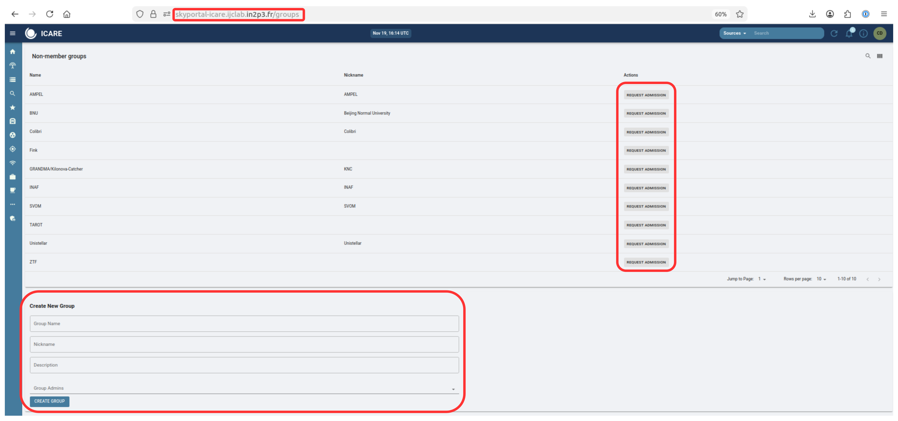

# User Guide

## Creating your IAM Account and login to Icare / SkyPortal

We will access to ICARE / SkyPortal through IAM's [login page](https://skyportal-icare.ijclab.in2p3.fr) to create your account.

First, click on `Sign in with IAM`:

ICARE welcome page             |
:-------------------------:|
  |

Then, choose the method of your choice:
* **Slack** is reserved for GRANDMA people.
* **ORCID** is available for anyone and is **preferred**.
* **Edugain** is available for anyone.

*If you are not able to use one of these methods to authenticate, please contact us to discuss alternatives.*

IAM login             |
:-------------------------:|
  |

### Notes on Slack registration
If you choose to create your IAM Account using Slack, you might be asked for your workspace name.
If that's the case, use `grandmagroupe` as workspace name.

### Notes on ORCID or eduGAIN registration
If you use ORCID, you can use your account as normal.

If you use eduGAIN, you need to select
your home institution: you can enter some letters from its name to filter the long list...

## Form registration

A form will be displayed: enter your `firstname`, `lastname`, `email` and `username`.
Also, you'll notice a `note` field. We request you to put your affiliation in this note, as well as other information
you may find useful. It is mandatory ! Upon submitting the form, a message will appear confirming that you applied for an account.

Account Creation Form             |  Submittion message
:-------------------------:|:-------------------------:
  |  

## Account validation

You will receive an email, asking you to validate your email, with a confirmation link.
Please click the link: accounts will not be validated until you confirmed your email.
**Your account won't be verified by an administrator until you do it.** Once it is done, wait
for your account to be validated by an administrator: once it is done you'll receive a new email
that also contains a link to set your IAM password: **just ignore it** as you will not need it
to access Icare with Slack, ORCID or eduGAIN.

Account Creation Confirmation email             |  Setting your password
:-------------------------:|:-------------------------:
  |  

## First connection to ICARE !

Now that your account as been verified, go to [https://skyportal-icare.ijclab.in2p3.fr](https://skyportal-icare.ijclab.in2p3.fr)
and click on `Sign in with IAM` button. Then choose the same authentication method you chose before (Slack, ORCID or eduGAIN).

SkyPortal login with IAM             |  Choose the same option as Before
:-------------------------:|:-------------------------:
  |  

If you want to enable other authentication methods for your account, look at the
[dedicated section](/#how-to-create-and-configure-your-iam-account) of the documentation.

Done !!! You will be redirected to your SkyPortal profile. By default, you should have the role of `Full user` and be a member of the `Sitewide` groups.

SkyPortal Profile Created             |
:-------------------------:|
  |

*Note: You can turn on email or Slack notification on your profile in case of mentions.*

You can create a new group or request access to a specific group in the `Groups` page :

Group management             |
:-------------------------:|
  |

## How to create and configure your IAM account.

It is recommended to create your IAM account before connecting to Icare by
connecting directly to the [IAM service](https://iam-grandma.ijclab.in2p3.fr/login).
You will have to enter some information required to create your account. Note that the that
the firstname, lastname, email you enter will be used to initialize your Skyportal
profile. The email you specifiy don't need to be the same as the email associated with the
Slack or eduGAIN account you used to authenticate and will be used as your Icare
identifier (username).

**Note: one of the mandatory information to create your IAM account is the `Note` field: we request you to put your
affiliation in this note, as well as other information you may find useful.**

Once your account has been created and verified, you can login again to
[Icare](https://skyportal-icare.ijclab.in2p3.fr) using your IAM account
A Icare username will be automatically created. You can edit it your profile information
by clicking on the button on the top-right corner of the Icare window.

If you want to be able to authenticate using several methods, once your IAM account has been
created and validated, connect again to the [IAM service](https://iam-grandma.ijclab.in2p3.fr/login),
use the same authentication method as for the account creation (or any that you already configured)
and click on button `Link external account`. Then choose the appropriate method and enter your
credentials. If you are familiar with certificates, you can also configure a certificate that
you can use to authenticate using the `Link certificate` button.
