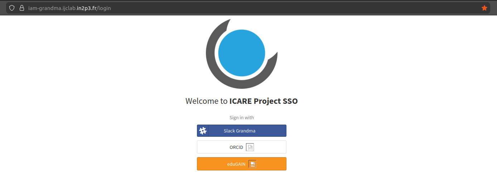
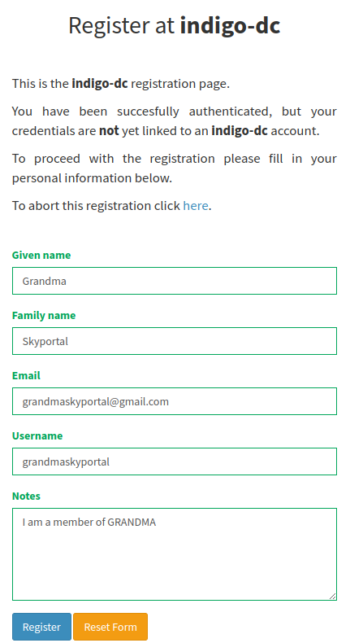
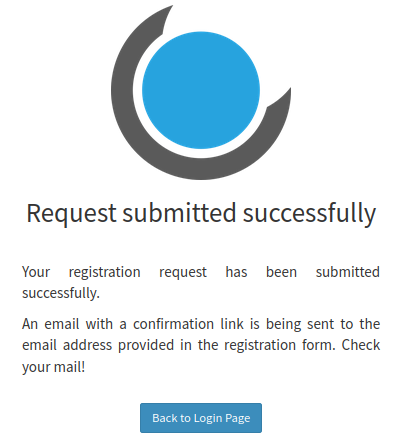
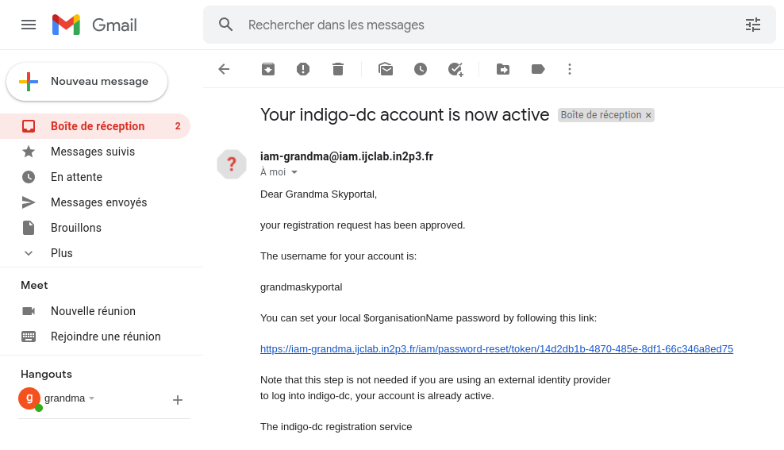
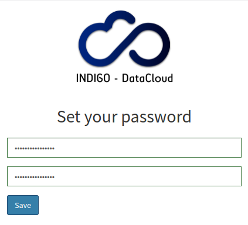
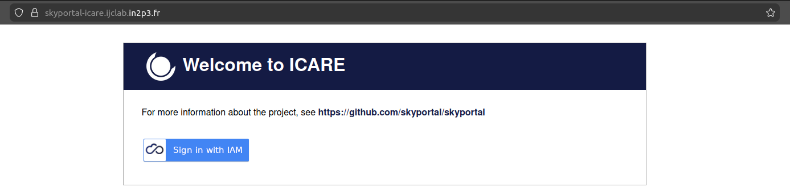
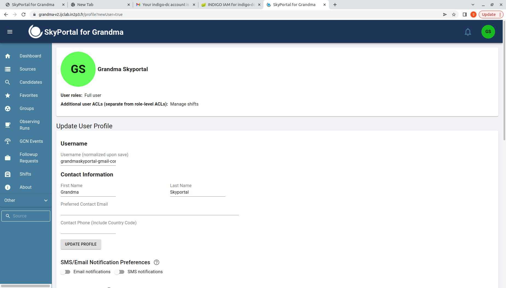

# User Guide

## Creating your IAM Account and login to SkyPortal

Step 1. We won't access SkyPortal but IAM's [login page](https://iam-grandma.ijclab.in2p3.fr) to create your account.
First, choose the method of your choice: Slack or EDUGain.
*If you are not able to use one of these methods to authenticate, please contact us to discuss alternatives.*

IAM login             |
:-------------------------:|
  |

If you choose to create your IAM Account using Slack, you might be asked for your workspace name.
If that's the case, use `granmagroupe` as workspace name. If you use eduGAIN, you need to select
your home institution: you can enter some letters from its name to filter the long list...

Step 2. A form will be displayed: enter your `firstname`, `lastname`, `email` and `username`.
Also, you'll notice a `note` field. We request you to put your affiliation in this note, as well as other information
you may find useful. It is mandatory ! Upon submitting the form, a message will appear confirming that you applied for an account.

Account Creation Form             |  Submittion message
:-------------------------:|:-------------------------:
  |  

Step 3. You will receive an email, asking you to validate your email, with a confirmation link.
Please click the link: accounts will not be validated until you confirmed your email.
**Your account won't be verified by an administrator until you do it.** Once it is done, wait
for your account to be validated by an administrator: once it is done you'll receive a new email
that also contains a link to set your IAM password: **just ignore it** as you will not need it
to access Icare with Slack or eduGAIN.

Account Creation Confirmation email             |  Setting your password
:-------------------------:|:-------------------------:
  |  

Step 4. Now that your account as been verified, go to [https://grandma-v2.ijclab.in2p3.fr/](https://grandma-v2.ijclab.in2p3.fr/)
and click on `Sign in with IAM` button. Then choose the same authentication method you chose before (Slack or EDUGain).

SkyPortal login with IAM             |  Choose the same option as Before
:-------------------------:|:-------------------------:
  |  

If you want to enable other authentication methods for your account, look at the
[dedicated section](/#how-to-create-and-configure-your-iam-account) of the documentation.

Step 5. Done !!! You will be redirected to your SkyPortal profile. By default, you should have the
role of `Full user`, the acls to `Manage shifts`, and be a member of the `Sitewide` and `GRANDMA` groups.

SkyPortal Profile Created             |
:-------------------------:|
  |
